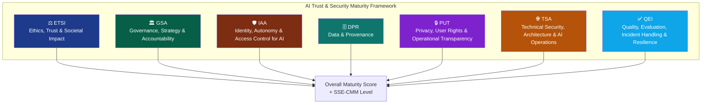
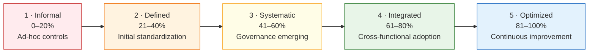
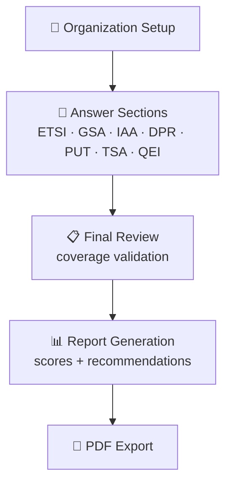

# AI Trust & Security Maturity Framework

> A Cybersecurity Maturity Assessment for Artificial Intelligence

A web platform that lets an organization evaluate, benchmark and evolve the **security and trustworthiness of its AI initiatives**. The application turns a conceptual maturity model into an operational, guided assessment flow with full data traceability, an interactive report and PDF export.

**Author:** Pedro Evangelista Saraiva

> **Academic context.** This project was developed as the applied component of my MBA final thesis (*Trabalho de Conclusão de Curso — TCC*), on the topic of **AI security maturity assessment**. It started from a generic AI-engineering maturity concept and was redesigned around a dedicated AI Trust & Security framework, including a refactor from multi-level questions to a binary (Yes/No) scoring model, a Portuguese/English bilingual interface, and a production deployment.

---

## Table of Contents

- [Overview](#overview)
- [The Assessment Framework](#the-assessment-framework)
  - [Domains](#domains)
  - [How Scoring Works](#how-scoring-works)
  - [Maturity Levels](#maturity-levels)
- [Key Features](#key-features)
- [Architecture](#architecture)
  - [Technology Stack](#technology-stack)
  - [Assessment Flow](#assessment-flow)
  - [Data Model](#data-model)
- [Getting Started](#getting-started)
  - [Run with Docker](#run-with-docker)
  - [Run Locally](#run-locally)
- [Deployment](#deployment)
- [Project Structure](#project-structure)
- [License](#license)

---

## Overview

The platform collects structured assessments organized as **Sections → Areas → Questions**, persists the responses and organizational metadata, computes a maturity score per area / section / overall, and presents an interactive HTML report that can be exported to PDF.

It is a Flask monolith with a server-rendered (Jinja2) UI plus supporting JSON endpoints. The source of truth is a relational database; assessment content (questions, area definitions, translations) lives in versioned JSON so it can evolve without schema migrations. The interface is fully bilingual (**Portuguese / English**).

## The Assessment Framework

The framework evaluates AI trust and security across **7 domains and 18 capability areas**.

### Domains



| Code | Domain | Capability Areas |
|------|--------|------------------|
| **ETSI** | Ethics, Trust and Societal Impact | Ethics, Social Impact & Transparency · Explainability, Transparency & Communication · Bias, Fairness & Responsible Use |
| **GSA** | Governance, Strategy and Accountability | Governance, Strategy & Compliance · Policies, Legal Compliance & Accountability · AI Security Awareness & Culture |
| **IAA** | Identity, Autonomy and Access Control for AI | Identity Governance for AI & Agents · Credential & Secret Management · Agents, Autonomy & Privilege |
| **DPR** | Data and Provenance | Inventory & Provenance · Data Quality, Governance & Minimization |
| **PUT** | Privacy, User Rights and Operational Transparency | Privacy, User Transparency & Control |
| **TSA** | Technical Security, Architecture and AI Operations | Threats, Risks & Operational Security · Secure Deployment & Architecture · Defects, Monitoring & Harmful Content |
| **QEI** | Quality, Evaluation, Incident Handling and Resilience | Testing, Evaluation & Improvement · Incident & Event Handling · Operational Continuity & Monitoring |

### How Scoring Works

Each question is **binary (Yes/No)** — a "Yes" represents a confirmed control or capability. Scores aggregate bottom-up:

- **Area score** = percentage of "Yes" answers within the area.
- **Section score** = average of its area percentages.
- **Overall score** = average of the section percentages.

The resulting percentage is then mapped to a maturity level.

### Maturity Levels

Classification follows an **SSE-CMM-inspired 5-level scale**:



| Level | Range | Meaning |
|-------|-------|---------|
| **Informal** | 0–20% | Ad-hoc controls; limited consistency; practices not standardized. |
| **Defined** | 21–40% | Controls defined; initial standardization; repeatable in pockets. |
| **Systematic** | 41–60% | Controls systematically applied; governance emerging; wider coverage. |
| **Integrated** | 61–80% | Controls integrated across the lifecycle; cross-functional adoption; measurable. |
| **Optimized** | 81–100% | Controls optimized; continuous improvement; predictive and proactive. |

## Key Features

- **Guided assessment flow** — step-by-step evaluation across sections and areas, with contextual help, risk descriptions and references for each area.
- **Bilingual interface (PT/EN)** — questions, labels and reports are fully internationalized via JSON overlays.
- **Maturity scoring engine** — binary scoring aggregated per area / section / overall, classified into SSE-CMM levels.
- **Interactive report** — score breakdown by section and area, gap and strength analysis, and an improvement roadmap.
- **PDF export** — the report is rendered to PDF on demand via headless Chromium (Playwright).
- **Assessment dashboard** — overview of all assessments with status tracking and drill-down into individual results.
- **Audit snapshot** — each completed assessment persists a `results_json` snapshot of its computed scores.

## Architecture

### Technology Stack

| Layer | Technology |
|-------|-----------|
| Language / Runtime | Python 3.11 |
| Web framework | Flask (Application Factory pattern) |
| ORM | SQLAlchemy |
| Templating | Jinja2 (server-rendered UI) |
| Database | SQLite (default) · PostgreSQL / MySQL supported |
| PDF generation | Playwright (headless Chromium) |
| Packaging / Deploy | Docker · Docker Compose · Fly.io |

### Assessment Flow



1. **Organization setup** — capture organization context, industry and assessor info; an assessment record is created with status `IN_PROGRESS`.
2. **Answer sections** — for each section the app loads its areas and questions; responses are upserted per question (state lives in the database, not the browser session).
3. **Final review** — validates minimum coverage before completion.
4. **Report generation** — recalculates scores, marks the assessment `COMPLETED`, persists aggregate scores and a `results_json` snapshot.
5. **PDF export** — the report view model is re-rendered into a print template and converted to PDF.

### Data Model

- **Section** — top-level domain of the framework (e.g. `TSA`).
- **Area** — capability sub-domain within a section.
- **Question** — a binary assessment item.
- **Assessment** — an evaluation instance (metadata, status, scores, JSON snapshot).
- **Response** — one answer per question, unique per `(assessment_id, question_id)`.

A detailed architecture document (C4 diagrams, data flow, design trade-offs) is available in [`docs/solution-architecture.md`](docs/solution-architecture.md).

## Getting Started

### Run with Docker

Helper scripts are provided for Linux/macOS (`docker-deploy.sh`) and Windows (`docker-deploy.bat`):

```sh
./docker-deploy.sh build    # build the image
./docker-deploy.sh start    # start the application
./docker-deploy.sh setup    # initialize the database (DDL + seed)
./docker-deploy.sh logs     # tail logs
./docker-deploy.sh shell    # open a shell inside the container
./docker-deploy.sh stop     # stop and remove volumes
```

> On Windows, use `docker-deploy.bat <command>` with the same verbs.
> `stop` also removes persistent volumes (database, uploads, logs); `setup` runs the DB initialization script inside the container.

### Run Locally

```sh
# 1. Install dependencies
pip install -r requirements.txt

# 2. Install the Playwright browser used for PDF export
playwright install chromium

# 3. Initialize the database (schema + seed data)
python scripts/setup_database.py

# 4. Start the app
python run.py
```

The app defaults to a SQLite database at `instance/app_dev.db` and selects its configuration via `FLASK_ENV`. The set of active domains is controlled by `ACTIVE_SECTION_IDS`.

## Deployment

The repository is configured for deployment to **Fly.io** (see [`fly.toml`](fly.toml)). The Docker image installs Playwright and its Chromium browser so PDF generation works in the container, and a persistent volume is mounted for the SQLite database.

## Project Structure

```
app/
  blueprints/      # web routes (main, assessment) + JSON endpoints
  models/          # SQLAlchemy models + maturity definitions / i18n overlays
  services/        # scoring, assessment and recommendation services
  utils/           # scoring helpers (SSE-CMM thresholds, math)
  i18n/            # PT / EN translation provider + JSON catalogs
config/            # base / development / production configuration
data/              # framework content: area definitions, question i18n
scripts/           # DB schema, seed data, setup & demo seeding
static/            # JS, assets, images
templates/         # Jinja2 templates (pages, components, PDF report)
docs/              # solution architecture documentation
```

## License

Developed by **Pedro Evangelista Saraiva** as an MBA final thesis (TCC) project. All rights reserved unless otherwise stated.
