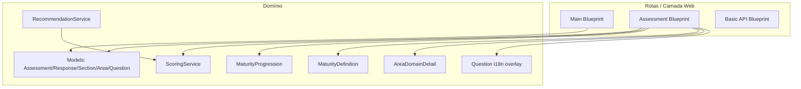

# Arquitetura de Solução — AI‑First Maturity Assessment Framework

Data: 2026-03-13  
Stack principal: Python 3.11 + Flask + SQLAlchemy + Jinja2 + Playwright (PDF)  

## 1) Objetivo e escopo
Esta aplicação implementa uma plataforma web para:
- Coletar avaliações (assessments) estruturadas por **Seções → Áreas → Perguntas**.
- Persistir respostas e metadados organizacionais.
- Calcular **scores** e **níveis de maturidade** a partir das respostas.
- Apresentar um **relatório interativo** (HTML) e permitir **exportação em PDF**.

O foco do projeto é transformar um framework conceitual de maturidade em um fluxo operacional (UX) com rastreabilidade dos dados e geração de insights.

## 2) Resumo executivo (high level)
- **Tipo de aplicação**: monólito Flask com UI server-rendered (Jinja) + endpoints JSON auxiliares.
- **Fonte de verdade**: banco relacional (SQLite por padrão), com entidades de domínio e dados mestre seedados.
- **Motor de cálculo**: serviços de scoring e (opcionalmente) recomendações, com classificação baseada em thresholds.
- **Relatórios**: montagem de um “view model” agregando DB + cálculos + conteúdo auxiliar (i18n, definições e progressões) para renderização.

## 3) Principais interfaces
### 3.1 UI Web (HTTP)
- Home/estatísticas/saúde: [app/blueprints/main/routes.py](../app/blueprints/main/routes.py)
- Jornada de assessment (criar, responder, revisão, relatório, PDF): [app/blueprints/assessment/routes.py](../app/blueprints/assessment/routes.py)

### 3.2 Endpoints JSON (suporte)
- API “basic v1” em `/api/v1/*`: [app/api/basic_api.py](../app/api/basic_api.py)
- Blueprint de API registrado em: [app/api/__init__.py](../app/api/__init__.py)

> Observação de engenharia: existe um conjunto de rotas REST mais completo em `app/api/assessments/routes.py`, porém o blueprint ativo atualmente é o “basic v1”. Se o objetivo for expor uma API REST completa, é recomendável ligar esses recursos no `create_api_blueprint()`.

### 3.3 Automação e scripts
- Setup do banco (DDL/DML) e validação: [scripts/setup_database.py](../scripts/setup_database.py)
- Esquema do banco (DDL): [scripts/database_schema.sql](../scripts/database_schema.sql)
- Seed de assessment completo para demo/teste: [scripts/seed_completed_assessment.py](../scripts/seed_completed_assessment.py)

## 4) C4 — Diagramas (Contexto, Contêineres, Componentes)

### 4.1 C4 — Contexto
```mermaid
flowchart LR
  U[Usuário (Liderança/Engenharia/Consultoria)] -->|Navegador| W[Aplicação Web AFS]
  W -->|Leitura/Escrita| DB[(Banco de Dados)]
  W -->|Carrega conteúdo| JSON[(JSONs de Conteúdo: i18n/definições)]
  W -->|Gera PDF| PW[Playwright/Chromium Headless]
```

### 4.2 C4 — Contêineres
```mermaid
flowchart TB
  subgraph Browser[Browser]
    UI[UI (HTML/CSS/JS)]
  end

  subgraph App[Container: Flask]
    BP[Blueprints (UI + endpoints JSON)]
    TPL[Templates Jinja]
    SVC[Service Layer (Scoring/Assessment/Recommendations)]
    ORM[SQLAlchemy Models]
    I18N[i18n Provider]
  end

  subgraph Data[Persistência]
    DB[(SQLite / Postgres / MySQL)]
    Files[(Arquivos JSON em data/ e app/i18n/)]
  end

  UI -->|HTTP| BP
  BP --> TPL
  BP --> SVC
  SVC --> ORM
  ORM --> DB
  I18N --> Files
  BP --> I18N
  BP -->|HTML→PDF| PW[Playwright]
```

### 4.3 C4 — Componentes (dentro do monólito)


## 5) Modelo de dados (visão conceitual)
Entidades principais e propósito:
- **Section**: macro-domínio do assessment (ex.: governança, qualidade etc.).
- **Area**: subdomínio dentro da seção.
- **Question**: item de avaliação (no projeto atual, há suporte forte a perguntas “binárias” por convenção/heurística).
- **Assessment**: instância de avaliação (metadados + status + scores + snapshot em JSON).
- **Response**: resposta por pergunta (score 1..4, notes, timestamp), com unicidade por `(assessment_id, question_id)`.

Referências:
- Model de Assessment: [app/models/assessment.py](../app/models/assessment.py)
- Model de Response: [app/models/response.py](../app/models/response.py)
- Models de Section/Area/Question: [app/models/question.py](../app/models/question.py)
- DDL: [scripts/database_schema.sql](../scripts/database_schema.sql)

## 6) Fluxo de dados (end-to-end) — do input ao relatório

### 6.1 Criação do assessment
1. Usuário inicia um assessment na UI.
2. A aplicação cria um registro em `assessments` com metadados (organização, contato, indústria etc.) e status `IN_PROGRESS`.
3. O usuário é redirecionado para a primeira seção ativa.

Rotas típicas:
- `/assessment/create` (GET render; POST cria assessment “legacy”).
- `/assessment/submit-assessment` (POST JSON cria assessment + responses em lote).

### 6.2 Coleta e persistência de respostas
1. Para uma seção, a aplicação carrega `Section → Areas → Questions`.
2. O usuário responde perguntas; ao submeter, o sistema faz **upsert** de `responses`.
3. A sessão do navegador é tratada como **efêmera**; o estado real está no banco.

Resultado:
- Tabela `responses` passa a conter o histórico “por pergunta” com timestamp, e opcionalmente notes.

### 6.3 Cálculo de score (pipeline de scoring)
O scoring é calculado sobre o subconjunto de perguntas “ativas” e “permitidas” (configurável por `ACTIVE_SECTION_IDS`).

Visão lógica:
- Para cada **Área**: computa $p=\frac{\#yes}{\#total}$.
- Para cada **Seção**: média dos percentuais das áreas.
- **Overall**: média dos percentuais das seções.
- Classificação SSE (Informal…Optimized) por thresholds.

Implementação:
- Serviço: [app/services/scoring_service.py](../app/services/scoring_service.py)
- Thresholds e utilitários: [app/utils/scoring_utils.py](../app/utils/scoring_utils.py)

### 6.4 Finalização e consistência do resultado
No “final review”, o sistema valida cobertura mínima (ex.: >= 80%). Ao gerar o relatório:
- Marca o assessment como `COMPLETED`.
- Persiste scores agregados (overall e por seção) e um snapshot em `results_json`.

### 6.5 Geração do relatório HTML (view model)
A rota de relatório compõe um “view model” combinando:
- **Score calculado** (ScoringService)
- **Estrutura do framework** (sections/areas/questions)
- **Responses** para derivar gaps/strengths
- **Conteúdo auxiliar**:
  - Definições de maturidade por área/nível: [app/models/maturity_definition.py](../app/models/maturity_definition.py)
  - Progressões (prereqs, ações, métricas etc.): [app/models/progression.py](../app/models/progression.py)
  - Contexto de risco/referências: [app/models/area_domain_detail.py](../app/models/area_domain_detail.py)
  - Tradução de perguntas/labels: [app/models/question_i18n.py](../app/models/question_i18n.py)

Saída:
- Página HTML com breakdown por seção/área, gráficos e roadmap.

### 6.6 Exportação para PDF
1. Renderiza template específico de PDF com o mesmo view model.
2. Usa Playwright (Chromium headless) para imprimir para PDF.
3. Retorna bytes como download (sem precisar persistir arquivo, por padrão).

Rota:
- `/assessment/<id>/download-pdf`

## 7) Armazenamento e governança dos dados
- **Dados transacionais**: `assessments` e `responses`.
- **Dados mestre**: `sections`, `areas`, `questions`, `maturity_progressions`.
- **Conteúdo versionável** (fora do DB): JSONs de i18n e definições, permitindo atualizar texto/descrições sem migrações.

Boas práticas observadas:
- Constraints e índices para integridade e consulta eficiente (ver DDL).
- `results_json` como snapshot de auditoria do cálculo (tradeoff: duplicação controlada vs reprocessamento).

## 8) Configuração e ambientes
- A aplicação usa Application Factory e seleciona config por `FLASK_ENV`:
  - Base: [config/base.py](../config/base.py)
  - Dev: [config/development.py](../config/development.py)
- Banco padrão em dev: `sqlite:///instance/app_dev.db`.
- `ACTIVE_SECTION_IDS` permite “ativar” um subconjunto de seções para o fluxo.

## 9) Segurança, privacidade e qualidade (práticas recomendadas)
**O que já existe**
- CSRF via Flask-WTF (com exceções pontuais para endpoints JSON): [app/extensions.py](../app/extensions.py)
- Logging com rotação configurável: [app/config.py](../app/config.py)

**Recomendações (alto nível)**
- Separar “dados pessoais” (PII) e aplicar políticas de retenção/anonimização, caso use em produção.
- Adicionar autenticação/autorização se houver multi-tenant real (por ora, é um app “single workspace” com foco em assessment).
- Formalizar validação de payloads JSON (Marshmallow/Pydantic) também no fluxo UI/JSON.

## 10) Observabilidade e operação
- Health endpoints úteis para orquestração e diagnóstico.
- Dockerfile já instala Playwright e browsers para PDF: [Dockerfile](../Dockerfile).
- docker-compose monta volume para `instance/` (persistência do SQLite): [docker-compose.yml](../docker-compose.yml).

## 11) Casos de uso (exemplos)
1. **Liderança** executa assessment sem fricção → gera PDF para comitê.
2. **Engenharia** identifica áreas críticas (gaps) → usa roadmap por área para priorizar iniciativas.
3. **Consultoria/PMO** roda múltiplos assessments ao longo do tempo → compara maturidade entre ciclos (quando evoluir as visões de analytics).

## 12) Notas de design (tradeoffs)
- **Monólito** facilita entrega e consistência; uma evolução natural seria extrair API e front desacoplado se precisar escala/integrações.
- **Relatório recalculado** no request garante “verdade atual” das regras; snapshot em `results_json` ajuda auditoria.
- **Conteúdo em JSON** permite evoluir texto/definições sem migração, mas exige disciplina de versionamento.

---

### Apêndice A — Rotas-chave (mapa rápido)
- Create: `/assessment/create` e `/assessment/submit-assessment`
- Seções: `/assessment/<id>/section/<section_id>`
- Finalização: `/assessment/<id>/final-review` e `/assessment/<id>/generate-report`
- Relatório: `/assessment/<id>/report`
- PDF: `/assessment/<id>/download-pdf`

### Apêndice B — Como rodar (referência rápida)
- Banco (dev): executar [scripts/setup_database.py](../scripts/setup_database.py)
- App: `python run.py`
- Docker: usar [docker-compose.yml](../docker-compose.yml)
